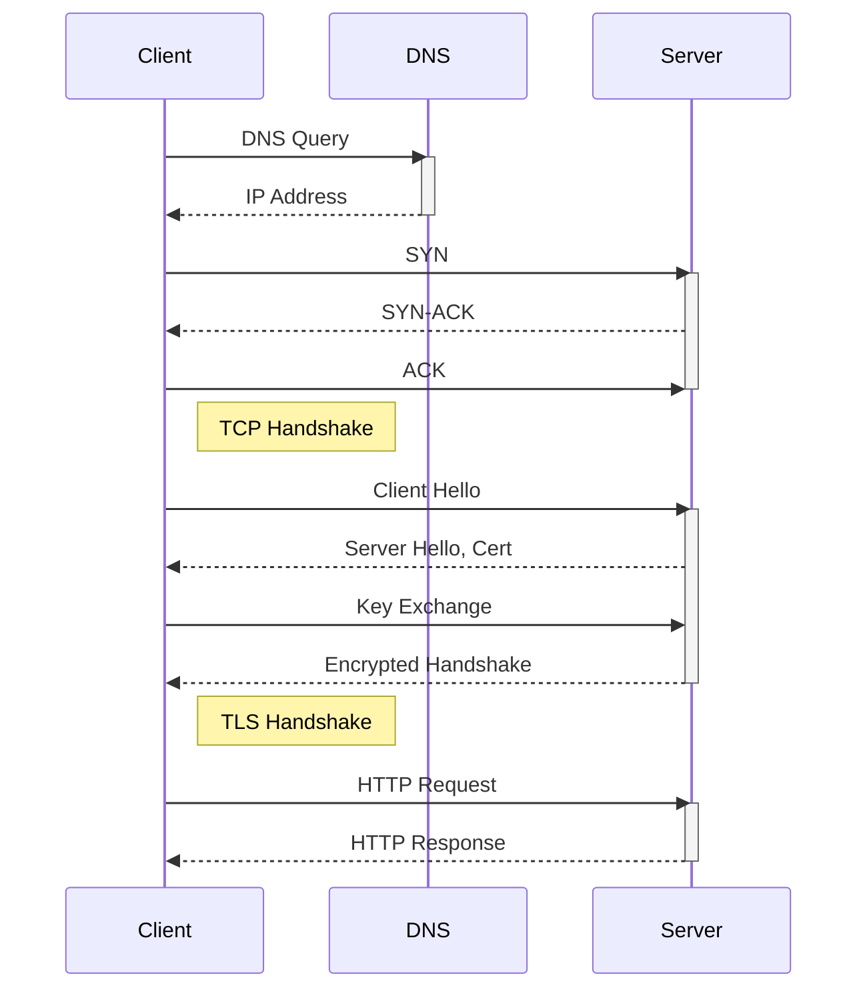

Answer:
Through [[DNS]], client (the browser) will resolve hostname of the URL to an IP address of the destination server. Then it establishes a [[TCP connection]] through a [[three-way handshake]]. On top of TCP connection, it establishes [[TLS connection]] though TLS handshake, so that only encrypted data is sent over the network. The client uses HTTP Protocol to send a request which contains headers and request payload to the destination server. The server responds with a status code, headers and response payload.
